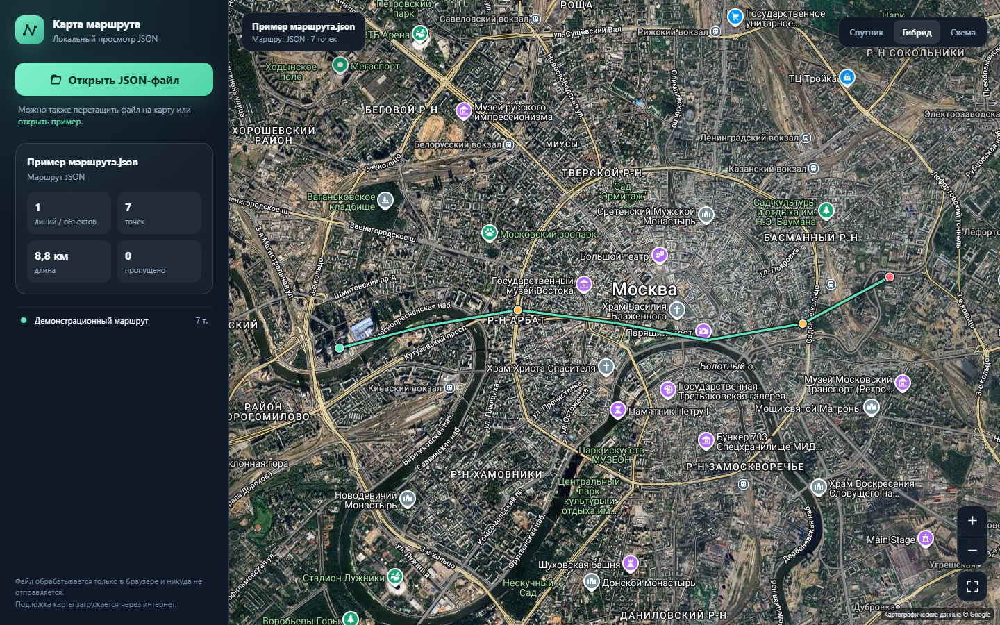

# Карта маршрута для компьютера

Переносимый просмотрщик JSON/GeoJSON с отображением данных поверх карты. Установка и сборка не нужны.

## Возможности

- открытие `.json` и `.geojson` через диалог или перетаскиванием на карту;
- спутниковая и гибридная подложка Google, схема OpenStreetMap;
- отображение нескольких маршрутов, специальных точек и полигонов;
- автоматический выбор масштаба и расчёт длины маршрута;
- сведения об ID, координатах, радиусе и флаге по щелчку на точке;
- работа одним HTML-файлом без сервера, установки и сборки.

## Запуск в Windows

1. Полностью распакуйте ZIP — не запускайте BAT прямо из окна архива.
2. Дважды щёлкните `START.bat` или откройте `RouteMap.html` в Chrome, Edge либо Firefox.
3. Нажмите **Открыть JSON-файл**.
4. Выберите файл `.json` / `.geojson`. Файл также можно перетащить прямо на карту.

Для проверки используйте `example-route.json` или ссылку **открыть пример** внутри просмотрщика.

Самый простой вариант — скачать только `RouteMap.html` и открыть его двойным щелчком. `START.bat` нужен лишь как удобный запускатель для Windows.

## Поддерживаемые форматы

- структура приложения «Спутник маршрутов»: `lines[] → points[] → latitude / longitude`;
- стандартный GeoJSON: `Point`, `MultiPoint`, `LineString`, `MultiLineString`, `Polygon`, `MultiPolygon` и `GeometryCollection`;
- корневой массив точек и объект с массивом `points`;
- поля координат `latitude / longitude`, `lat / lon`, `lat / lng` и пары `[longitude, latitude]`;
- спутниковая, гибридная и обычная картографическая подложка;
- перетаскивание и масштабирование карты, автоматический показ всего маршрута;
- сведения о точке по щелчку рядом с ней;
- несколько линий, специальные точки с ненулевым `flag` и расчёт длины при её отсутствии.

## Конфиденциальность и интернет

JSON читается локально средствами браузера и никуда не загружается. Интернет нужен только для получения спутниковой подложки Google или схемы OpenStreetMap. Спутниковый и гибридный слои используют тот же источник Google, что и проект `irrigation-calculator-app`. Максимальный размер открываемого файла — 50 МБ.

Если подложка не появилась, проверьте доступ к доменам `google.com` и `openstreetmap.org` в браузере или корпоративном брандмауэре.

## Технологии

Приложение написано на HTML, CSS и JavaScript без внешних библиотек и системы сборки. Картографические тайлы загружаются непосредственно поставщиками подложек.
